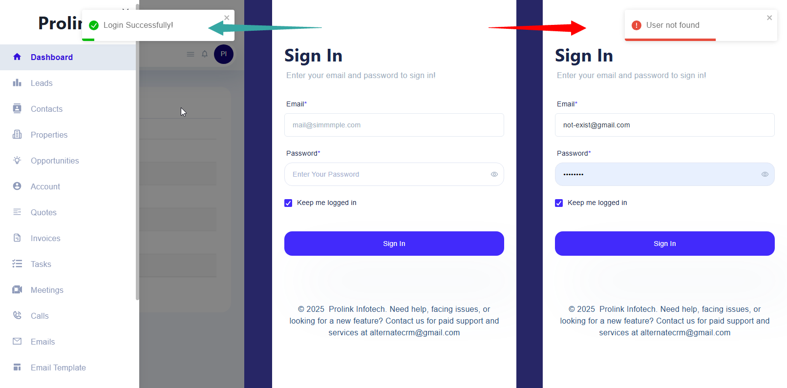
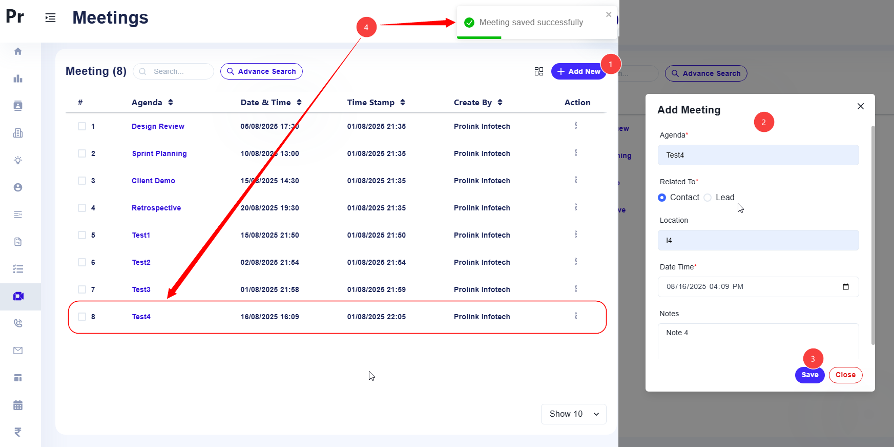
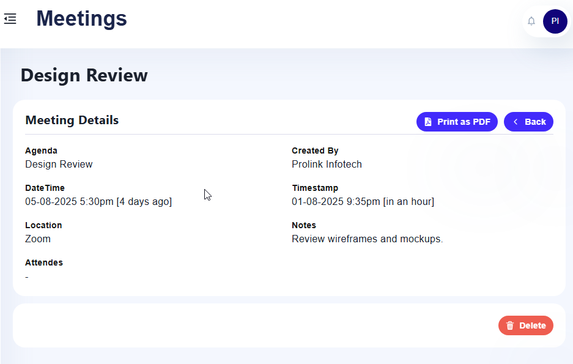
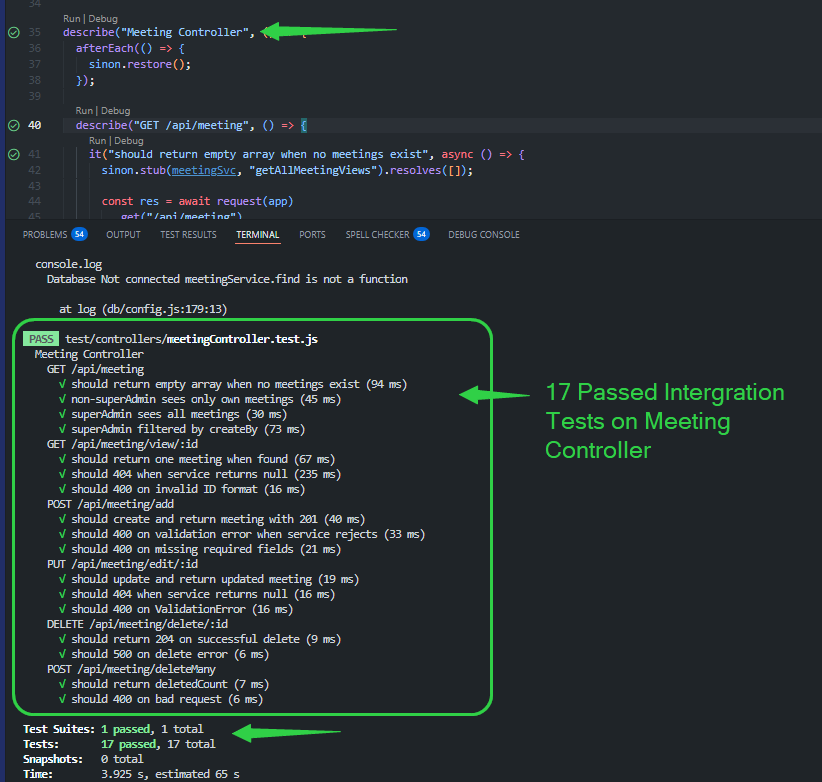
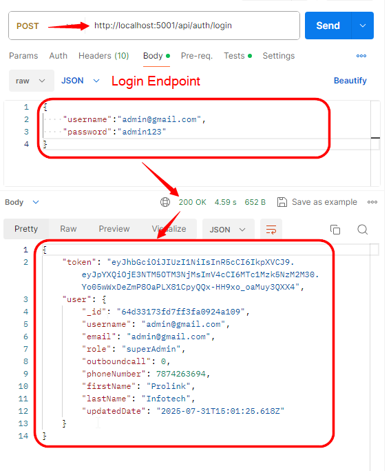
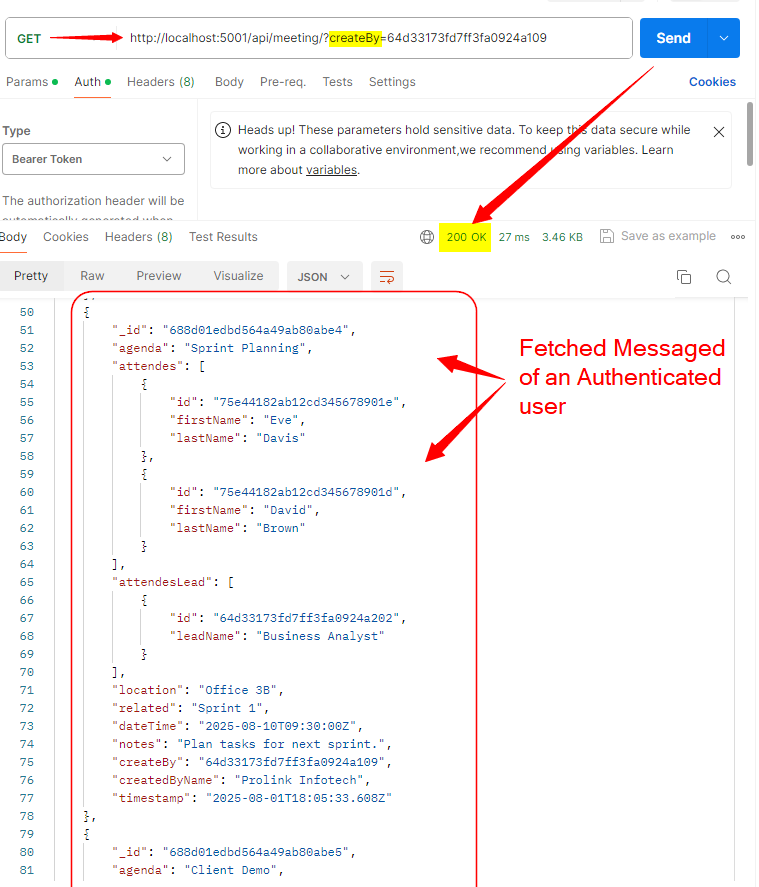
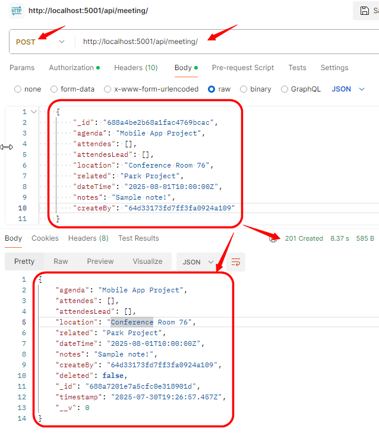
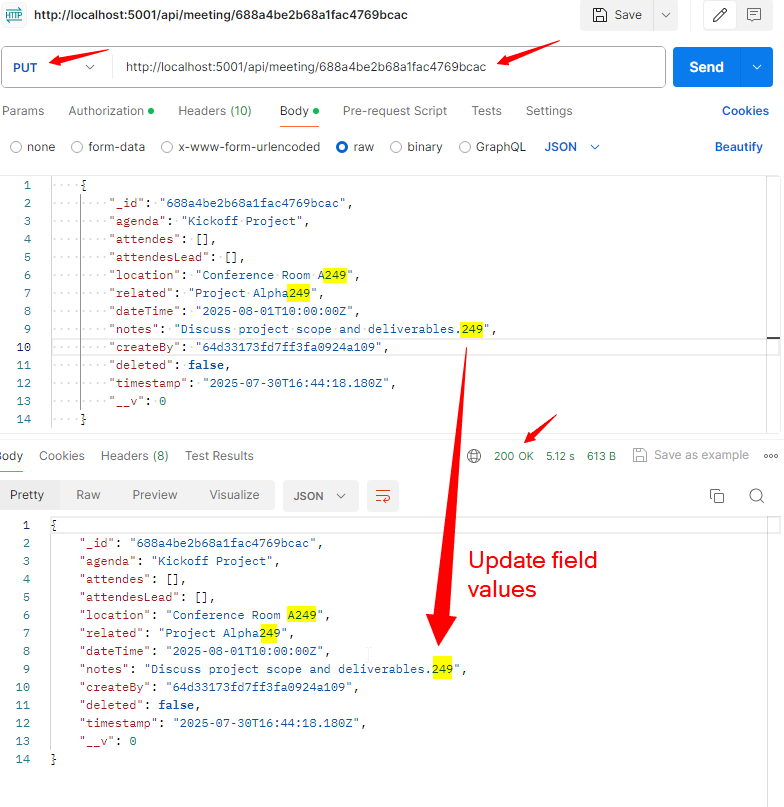
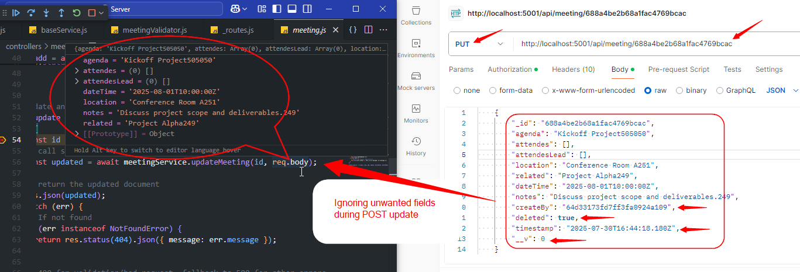
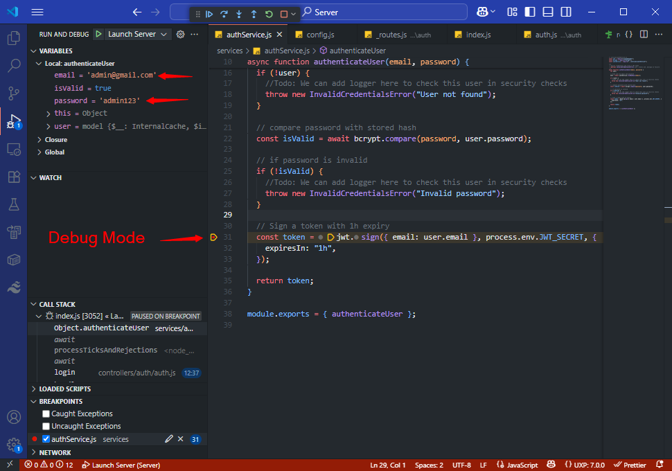

# ReactNode Client and Server Applications
**Welcome to my new features that I implemented in both Client and Server Applications**

Developr of the following new features: [Ramin Bateni Parvar](https://www.linkedin.com/in/ramin-bateni-parvar/)

## ReactNode Client
Let have a look at the results in client side first!

### Login success and failure states
Now you can sign-in to the project with your email and password (JWT Token Support).
<p align="center">
  
</p>

### Success create meeting
You can add meeting in its page, list the meetings and one or batch delete.
<p align="center">
  
</p>

### Meeting details
Click on a meeting to see its details.
<p align="center">
  
</p>

## Client Quick Start

1. **Install dependencies**  
```bash
   cd Client
   npm install
   npm start     # OR    press F5 in VS Code
```

## New Features
- **Authentication**  
  - Get and stores JWT and user info in `localStorage`  
  - Auto-attaches `Authorization: Bearer <token>` header via refactored `api.js`

- **API Service Refactor**  
  - Use slashWrapped for paths and some other refactorings for DRY code in api.js

- **Meetings Management**  
  - Data table with View, Add, Edit, Delete & Bulk Delete  
  - Add/Edit modal submits to `/api/meeting/add` and `/api/meeting/edit/:id`  
  - Updates table automatically on success

---------------------------------------

## ReactNode Server

This is the **Server** part of the **ReactNode** project, built with **Node.js**, **Express**, **MongoDB**, and **JWT**. It provides a RESTful API for managing **Meetings** with full **CRUD** functionality, along with authentication and test coverage.

### New Features

- **Authentication**
  - JWT-based authentication.
  - Login endpoint to generate JWT tokens.
- **Meeting API (CRUD)**
  - **Create** a meeting → `POST /api/meeting/add`
  - **Read all** meetings → `GET /api/meeting`
  - **Read one** meeting by ID → `GET /api/meeting/view/:id`
  - **Update** a meeting → `PUT /api/meeting/edit/:id`
  - **Delete** a meeting → `DELETE /api/meeting/delete/:id`
  - **Bulk-delete** meetings → `POST /api/meeting/deleteMany`
  - **Soft-Delete** is considered in all endpoints
- **Validation**
  - Request body validation using **Joi**.
  - Separate schemas for **create** and **update** with appropriate required/optional fields.
- **Error Handling**
  - Uniform error responses with proper HTTP status codes.
  - Custom `NotFoundError` and utility for error messages.
- **Docker Compose & MongoDB Container**
  - `mongo:latest` in `prolink` container, DB set via `DB_NAME`  
  - Exposes port 27017, data in `mongo-data` volume 
- **Testing**
  - **Jest** + **Supertest** for 17 integration tests.
  - **Sinon** for service method stubbing.
  - Full coverage for all endpoints under `test/controllers/meetingController.test.js`.

<p align="center">
  
</p>

### Database Seeding

To help you get started quickly, we’ve included a set of seed scripts that populate your MongoDB with realistic sample data:

- **Users**: `seedUsers.js` inserts five users (with pre-defined ObjectIds) and hashes their passwords before saving.  
- **Contacts**: `seedContacts.js` creates a handful of contact records, each with a unique ObjectId and personal details.  
- **Leads**: `seedLeads.js` adds several leads (e.g. “Project Manager”, “QA Lead”) using ObjectIds and `leadName` fields.  
- **Meetings**: `seedMeetings.js` generates five meetings, each linking random contacts and leads via `attendes` and `attendesLead` arrays, and assigns them to an admin user.

Each script first checks whether its collection is empty, so you can run them safely without duplicating data. To run all seeds at once, simply execute:  

```bash
# Just press F5 in Vs Code or run:  npm start , it seed database
```

### Some images from added features in server side:

#### ● Get token and user info
<p align="center">
  
</p>

#### ● Get mettings
<p align="center">
  
</p>

#### ● Success create meeting
<p align="center">
  
</p>

#### ● Success update meeting
<p align="center">
  
</p>

#### ● Ignoring unwanted fields durin validation by joi
<p align="center">
  
</p>

#### ● Debuging the project in VS Code
<p align="center">
  
</p>


### Server Quick Start

1. **Clone the repo**
   ```bash
   git clone https://github.com/<MY REPO NAME>/ReactNodeTest.git
   cd ReactNodeTest/Server
   ```

2. **Install dependencies**
   ```bash
   npm install
   ```

3. **Environment Variables**
   - Create a `.env` file in the `Server` directory:
     ```
     PORT=5001
     DB_URL=mongodb://127.0.0.1:27017
     DB_NAME=prolink
     JWT_SECRET=your_jwt_secret
     ```
     
4. **Run MongoDB server on your system. You can use my Docker Compose file too.**
   ```powershell
   # Open powershell in the Server folder and run:
   docker-compose up -d
   ```

5. **Run the Server**
   ```bash
   npm start
   ```

6. **Run Tests**
   ```bash
   npm test
   ```

### API Usage

### Login
- **Endpoint:** `POST /api/auth/login`
- **Body:**
  ```json
  {
    "email": "admin@gmail.com",
    "password": "admin123"
  }
  ```
- **Response:**
  ```json
  {
    "token": "..."
  }
  ```

#### Meetings  
Use the `Authorization: Bearer <token>` header (unless `SKIP_AUTH=true`).

- **Create Meeting**  
  ```http
  POST /api/meeting/add
  ```
  Body:
 ```json
{
  "agenda": "Sprint Planning",
  "dateTime": "2025-08-01T09:00:00.000Z",
  "attendes": ["688d01edbd564a49ab80abe3","688d01edbd564a49ab80abe4"],
  "attendesLead": ["688d01edbd564a49ab80abe2"],
  "location": "Room A",
  "related": "Contact",
  "notes": "Discussion items",
  "createBy": "688d01edbd564a49ab80abe3"
}
  ```

- **Get All Meetings**
```http
GET /api/meeting
```

- **Get Meetings by Creator**
```http
GET /api/meeting?createBy=<creatorId>
```

- **Get Meeting by ID**
```http
  GET /api/meeting/view/:id
```

- **Update Meeting**
```http
 PUT /api/meeting/edit/:id
```
  Body (at least one field):
  ```json
  {
    "location": "Room B"
  }
  ```

- **Delete Meeting**
```http
  DELETE /api/meeting/delete/:id
```

- **Bulk Delete Meetings**
```http
  POST /api/meeting/deleteMany
```
  Body:
```json
  {
    "ids": ["id1", "id2"]
  }
```
